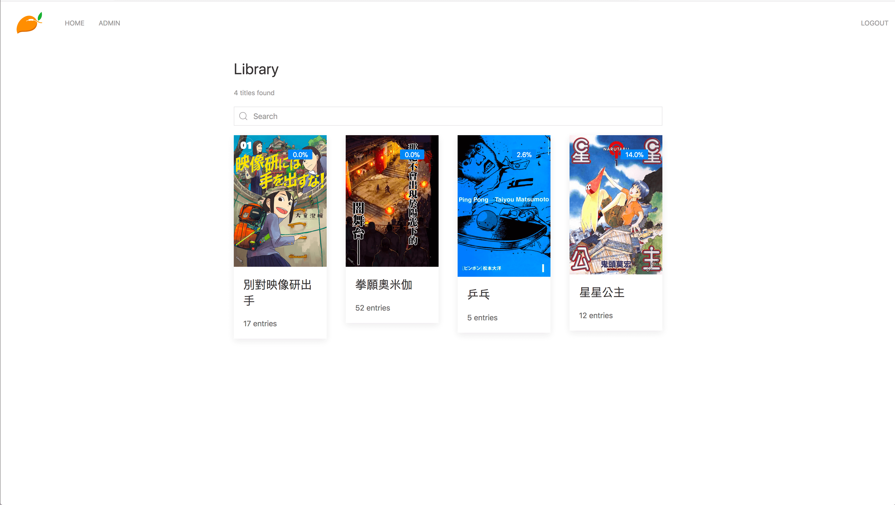
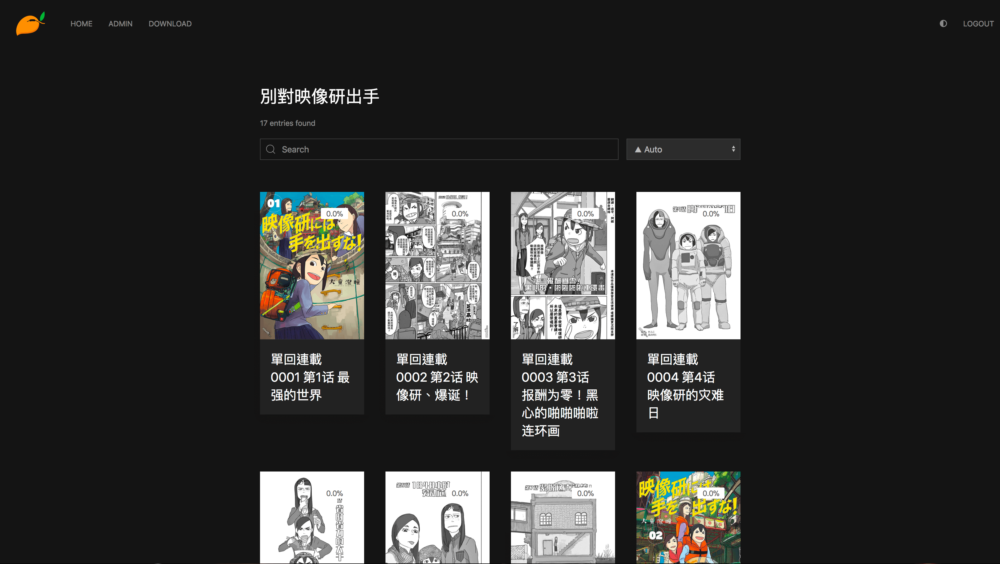
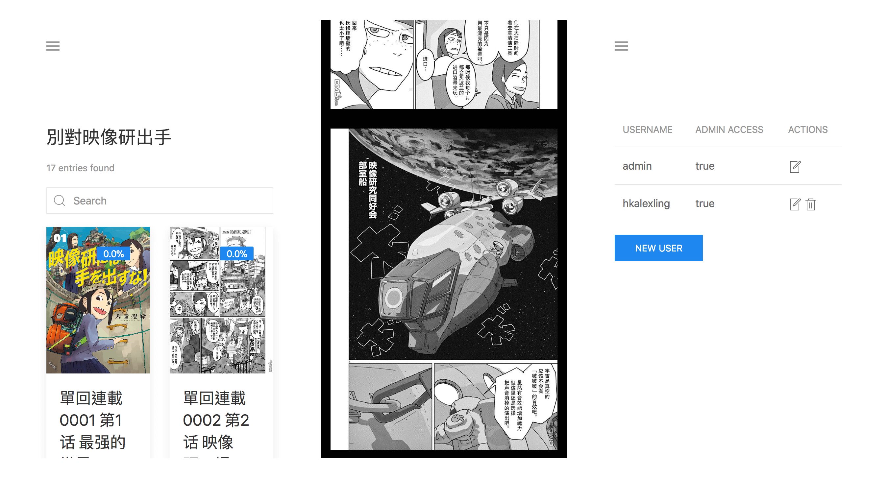

# Mango

[](https://www.patreon.com/hkalexling)  [](https://gitter.im/mango-cr/mango?utm_source=badge&utm_medium=badge&utm_campaign=pr-badge) [](http://discord.com/invite/ezKtacCp9Q)

Mango is a self-hosted manga server and reader. Its features include

- Multi-user support
- OPDS support
- Dark/light mode switch
- Supported formats: `.cbz`, `.zip`, `.cbr` and `.rar`
- Supports nested folders in library
- Automatically stores reading progress
- Thumbnail generation
- Supports [plugins](https://github.com/hkalexling/mango-plugins) to download from thrid-party sites
- The web reader is responsive and works well on mobile, so there is no need for a mobile app
- All the static files are embedded in the binary, so the deployment process is easy and painless

Please check the [Wiki](https://github.com/hkalexling/Mango/wiki) for more information.

## Installation

### Pre-built Binary

Simply download the pre-built binary file `mango` for the latest [release](https://github.com/hkalexling/Mango/releases). All the dependencies are statically linked, and it should work with most Linux systems on amd64.

### Docker

1. Make sure you have docker installed and running. You will also need `docker-compose`
2. Clone the repository
3. Copy the `env.example` file to `.env`
4. Fill out the values in the `.env` file. Note that the main and config directories will be created if they don't already exist. The files in these folders will be owned by the root user
5. Run `docker-compose up`. This should build the docker image and start the container with Mango running inside
6. Head over to `localhost:9000` (or a different port if you changed it) to log in

### Docker (via Dockerhub)

The official docker images are available on [Dockerhub](https://hub.docker.com/r/hkalexling/mango).

### Build from source

1. Make sure you have `crystal`, `shards` and `yarn` installed. You might also need to install the development headers of some libraries. Please see the [Dockerfile](https://github.com/hkalexling/Mango/blob/master/Dockerfile) for the full list of dependencies
2. Clone the repository
3. `make && sudo make install`
4. Start Mango by running the command `mango`
5. Head over to `localhost:9000` to log in

## Usage

### CLI

```
  Mango - Manga Server and Web Reader. Version 0.24.0

  Usage:

    mango [sub_command] [options]

  Options:

    -c PATH, --config=PATH           Path to the config file [type:String]
    -h, --help                       Show this help.
    -v, --version                    Show version.

  Sub Commands:

    admin   Run admin tools
```

### Config

The default config file location is `~/.config/mango/config.yml`. It might be different if you are running Mango in a docker container. The config options and default values are given below

```yaml
---
host: 0.0.0.0
port: 9000
base_url: /
session_secret: mango-session-secret
library_path: ~/mango/library
db_path: ~/mango/mango.db
scan_interval_minutes: 5
thumbnail_generation_interval_hours: 24
log_level: info
upload_path: ~/mango/uploads
plugin_path: ~/mango/plugins
download_timeout_seconds: 30
library_cache_path: ~/mango/library.yml.gz
cache_enabled: false
cache_size_mbs: 50
cache_log_enabled: true
disable_login: false
default_username: ""
auth_proxy_header_name: ""
mangadex:
  base_url: https://mangadex.org
  api_url: https://api.mangadex.org/v2
  download_wait_seconds: 5
  download_retries: 4
  download_queue_db_path: ~/mango/queue.db
  chapter_rename_rule: '[Vol.{volume} ][Ch.{chapter} ]{title|id}'
  manga_rename_rule: '{title}'
```

- `scan_interval_minutes`, `thumbnail_generation_interval_hours` and `db_optimization_interval_hours` can be any non-negative integer. Setting them to `0` disables the periodic tasks
- `log_level` can be `debug`, `info`, `warn`, `error`, `fatal` or `off`. Setting it to `off` disables the logging
- You can disable authentication by setting `disable_login` to true. Note that `default_username` must be set to an existing username for this to work.
- By setting `cache_enabled` to `true`, you can enable an experimental feature where Mango caches library metadata to improve page load time. You can further fine-tune the feature with `cache_size_mbs` and `cache_log_enabled`.

### Library Structure

You can organize your archive files in nested folders in the library directory. Here's an example:

```
.
├── Manga 1
│   ├── Volume 1.cbz
│   ├── Volume 2.cbz
│   ├── Volume 3.cbz
│   └── Volume 4.zip
└── Manga 2
    └── Vol. 1
        └── Ch.1 - Ch.3
            ├── 1.zip
            ├── 2.zip
            └── 3.zip
```

### Initial Login

On the first run, Mango would log the default username and a randomly generated password to STDOUT. You are advised to immediately change the password.

## Screenshots

Library:



Title:


Dark mode:



Reader:


Mobile UI:



## Sponsors

<a href="https://casinoshunter.com/online-casinos/"></a>
<a href="https://www.browserstack.com/open-source"></a>

## Contributors

Please check the [development guideline](https://github.com/hkalexling/Mango/wiki/Development) if you are interested in code contributions.
<!-- ALL-CONTRIBUTORS-LIST:START - Do not remove or modify this section -->
<!-- prettier-ignore-start -->
<!-- markdownlint-disable -->
<table>
  <tr>
    <td align="center"><a href="https://github.com/hkalexling/"><br /><sub><b>Alex Ling</b></sub></a><br /><a href="https://github.com/hkalexling/Mango/commits?author=hkalexling" title="Code">💻</a> <a href="https://github.com/hkalexling/Mango/commits?author=hkalexling" title="Documentation">📖</a> <a href="#infra-hkalexling" title="Infrastructure (Hosting, Build-Tools, etc)">🚇</a></td>
    <td align="center"><a href="https://github.com/jaredlt"><br /><sub><b>jaredlt</b></sub></a><br /><a href="https://github.com/hkalexling/Mango/commits?author=jaredlt" title="Code">💻</a> <a href="#ideas-jaredlt" title="Ideas, Planning, & Feedback">🤔</a> <a href="#design-jaredlt" title="Design">🎨</a></td>
    <td align="center"><a href="https://windisco.com/"><br /><sub><b>ココロ</b></sub></a><br /><a href="#infra-shincurry" title="Infrastructure (Hosting, Build-Tools, etc)">🚇</a></td>
    <td align="center"><a href="https://catgirlsin.space/"><br /><sub><b>Valentijn</b></sub></a><br /><a href="#infra-noirscape" title="Infrastructure (Hosting, Build-Tools, etc)">🚇</a></td>
    <td align="center"><a href="https://github.com/flying-sausages"><br /><sub><b>flying-sausages</b></sub></a><br /><a href="https://github.com/hkalexling/Mango/commits?author=flying-sausages" title="Documentation">📖</a> <a href="#ideas-flying-sausages" title="Ideas, Planning, & Feedback">🤔</a></td>
    <td align="center"><a href="https://github.com/XavierSchiller"><br /><sub><b>Xavier</b></sub></a><br /><a href="#infra-XavierSchiller" title="Infrastructure (Hosting, Build-Tools, etc)">🚇</a></td>
    <td align="center"><a href="https://github.com/WROIATE"><br /><sub><b>Jarao</b></sub></a><br /><a href="#infra-WROIATE" title="Infrastructure (Hosting, Build-Tools, etc)">🚇</a></td>
  </tr>
  <tr>
    <td align="center"><a href="https://github.com/Leeingnyo"><br /><sub><b>이인용</b></sub></a><br /><a href="https://github.com/hkalexling/Mango/commits?author=Leeingnyo" title="Code">💻</a></td>
    <td align="center"><a href="http://h45h74x.eu.org"><br /><sub><b>Simon</b></sub></a><br /><a href="https://github.com/hkalexling/Mango/commits?author=h45h74x" title="Code">💻</a></td>
    <td align="center"><a href="https://github.com/davidkna"><br /><sub><b>David Knaack</b></sub></a><br /><a href="#infra-davidkna" title="Infrastructure (Hosting, Build-Tools, etc)">🚇</a></td>
    <td align="center"><a href="https://lncn.dev"><br /><sub><b>i use arch btw</b></sub></a><br /><a href="#infra-lincolnthedev" title="Infrastructure (Hosting, Build-Tools, etc)">🚇</a></td>
  </tr>
</table>

<!-- markdownlint-restore -->
<!-- prettier-ignore-end -->

<!-- ALL-CONTRIBUTORS-LIST:END -->
